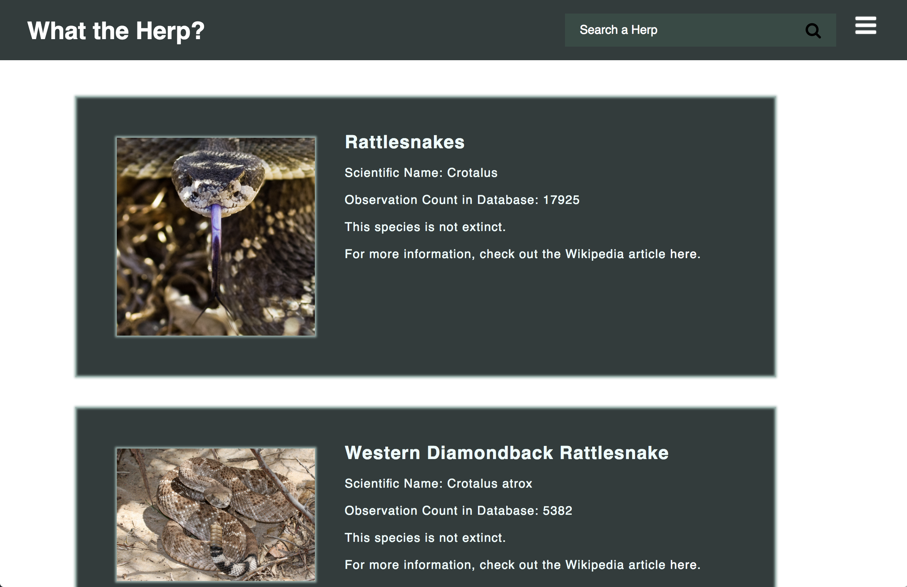
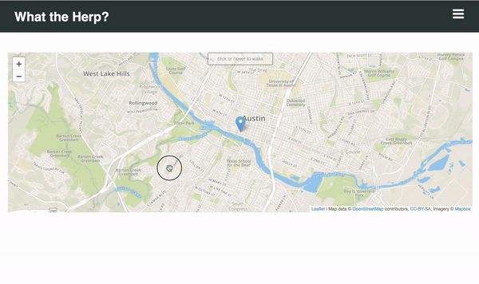

# What the Herp? 

This is my first quarter project for Galvanize! It's a site that you can visit to check out your favorite (or least favorite) reptiles and amphibians. 

**To View:** 
* Visit the site [here](https://whattheherp.surge.sh) .
* Fork and clone. For this, you'll need to run a simple server: 
```
python -m SimpleHTTPServer
```
After that, you'll visit localhost:8000 to start perusing.


*Note:* You will need to enable your location in order to see the map.


**GETTING STARTED:**
You can start out on the home page (index) and either use the menu in the upper left corner to pick your next location, or you can go to the icons at the bottom of the page for the three most beneficial pages. 


## Home 
Check out the dropdown menu or the icons at the bottom to help you get to your next location. Additionally, the title (What the Herp?) is a link that will take you back to the homepage (from any site on the page).


## Learn
This page allows you to search for a vast array of animals (plants, too!) and get a small snippet about them, including a link to their Wikipedia page. Both the Enter key and clicking the search button will allow you to complete your search. You'll also notice that at each new search, the previous results clear (this was actually something that took a long time to sort out since Chrome was caching results). 

Goals for future: Add more information to the individual cards once additional API keys have been approved. Additionally, add a notice if a search result does not exist or if the photo for that particular item isn't available. I'd also like to add a search suggestion tool. 



## Map
This page not only finds your location automatically, but also allows you to store a new pin wherever you want using local storage. 

Goals for future: Enable text upon storing data point and custom markers. 





